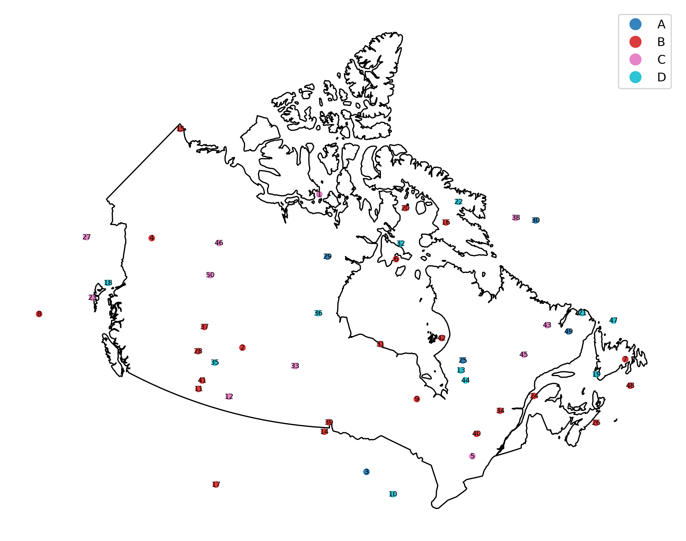

# can_geomap

A small Python utility that plots geographic points on a map of Canada, color-coded by category and labeled by ID. Used to visualize competitors' location and activity. Reads coordinates from an Excel file, draws them over a Natural Earth basemap reprojected to the Canada Atlas Lambert projection, and exports a high-resolution PNG.



## Features

- Reads point data (latitude, longitude, category, id) from an Excel spreadsheet.
- Renders a clean map of Canada using a Natural Earth 1:50m countries shapefile.
- Color-codes points by category with an automatic legend.
- Labels every point with its ID for easy cross-reference back to the source data.
- Reprojects to **EPSG:3347** (Statistics Canada Lambert / Canada Atlas Lambert) so distances and shapes are not distorted toward the poles.
- Exports a 300 DPI PNG suitable for reports or print.

## Project structure

```
can_geomap/
├── can_geomap.py                       # Main script
├── locations.xlsx                      # Input points (id, latitude, longitude, category)
├── canada_points.png                   # Example rendered output
├── ne_50m_admin_0_countries.shp        # Natural Earth basemap (with .dbf, .shx, .prj, .cpg)
├── ne_50m_admin_0_countries.README.html
├── ne_50m_admin_0_countries.VERSION.txt
├── requirements.txt
├── .gitignore
├── LICENSE
└── README.md
```

## Requirements

- Python 3.9 or newer
- `pandas`
- `geopandas`
- `matplotlib`
- `openpyxl` (used by pandas to read `.xlsx` files)

`geopandas` brings in `shapely`, `pyproj`, and `fiona` automatically.

## Installation

Clone the repo:

```bash
git clone https://github.com/yc6393/can_geomap.git
cd can_geomap
```

Set up a virtual environment and install dependencies:

```bash
python -m venv .venv
source .venv/bin/activate          # Windows: .venv\Scripts\activate
pip install -r requirements.txt
```

If `geopandas` is hard to install on your platform, conda is usually the smoothest path:

```bash
conda create -n can_geomap python=3.11 pandas geopandas matplotlib openpyxl
conda activate can_geomap
```

## Usage

From the project root:

```bash
python can_geomap.py
```

The script will:

1. Load the Natural Earth countries shapefile and filter to Canada.
2. Load the points from `locations.xlsx`.
3. Reproject both layers to EPSG:3347.
4. Plot Canada in white with black borders, draw the points colored by category, and label each point with its ID.
5. Save the result as `canada_points.png` (300 DPI) and open an interactive Matplotlib window.

## Input format

`locations.xlsx` must contain the following columns (case-sensitive):

| Column      | Type   | Description                              |
| ----------- | ------ | ---------------------------------------- |
| `id`        | int    | Unique identifier shown as a point label |
| `latitude`  | float  | WGS84 latitude in decimal degrees        |
| `longitude` | float  | WGS84 longitude in decimal degrees       |
| `category`  | string | Category used for color-coding           |

Example:

| id | latitude  | longitude   | category |
| -- | --------- | ----------- | -------- |
| 1  | 69.460026 | -100.757077 | C        |
| 2  | 54.724181 | -109.113761 | B        |
| 3  | 45.261372 |  -90.416296 | A        |

The bundled `locations.xlsx` ships with 50 sample points across four categories (A, B, C, D).

## Configuration

The most common things you might want to change live at the top of `can_geomap.py`:

```python
EXCEL_FILE = "locations.xlsx"
SHAPEFILE  = "ne_50m_admin_0_countries.shp"

LAT_COL = "latitude"
LON_COL = "longitude"
CAT_COL = "category"
```

Other knobs worth knowing about:

- **Output filename / DPI** — see the `plt.savefig(...)` call near the bottom of `main()`.
- **Marker size and transparency** — `markersize` and `alpha` in the points `plot` call.
- **Label font size** — the `fontsize` argument inside the labeling loop.
- **Projection** — change the `epsg=3347` arguments to use a different CRS.

## Output

Running the script produces `canada_points.png` in the project directory and prints progress messages to the console:

```
Loading Canada boundary...
Loading Excel locations...
Creating map...

Map successfully saved as canada_points.png
```

## Data attribution

Country boundaries come from [Natural Earth](https://www.naturalearthdata.com/) — free vector and raster map data made by volunteers and supported by NACIS. The 1:50m Admin 0 Countries dataset is included in this repo for convenience; see `ne_50m_admin_0_countries.README.html` for the original notes.

## License

This project is released under the [MIT License](LICENSE). The bundled Natural Earth data is public domain and is not covered by the MIT license — see the Natural Earth [terms of use](https://www.naturalearthdata.com/about/terms-of-use/).
